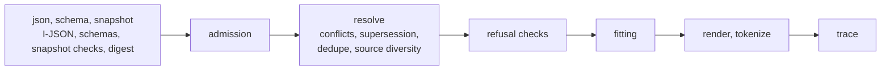

# contextwindowarchitecture-assembler

A Rust assembler for the [Context Window Architecture](https://contextwindowarchitecture.io) (CWA) draft specification. It admits candidate items, resolves declared conflicts, fits them to a token budget, renders the payload and emits the trace.

Status: passes all 61 published conformance cases and rejects all 25 rejection snapshots of the vendored contract (specification repository `a56fb2d`), including the cases of the optional `cwa-message-blocks/v1` renderer; `conformance-report.json` records the run.

## Install

```toml
[dependencies]
contextwindowarchitecture-assembler = { git = "https://github.com/contextwindowarchitecture/assembler-rust" }
```

## Use

```rust
use contextwindowarchitecture_assembler::{assemble, assemble_with, Error, Options};

let snapshot = std::fs::read("snapshot.json")?;
match assemble(&snapshot) {
    Ok(assembly) => {
        // assembly.payload: Some(bytes) to send to the model, or None when the assembly was refused,
        // in which case assembly.trace.refused.reason says why.
        let trace = assembly.trace.to_json();
    }
    Err(Error::Rejected(problems)) => { /* the snapshot is invalid: no payload and no trace */ }
    Err(Error::Unsupported(lines)) => { /* "tokenizer <id> is not provided", "renderer <id> is not provided" */ }
    Err(Error::PublishedId(message)) => { /* an application tokenizer under a published id */ }
}

// The model's own tokenizer, under an id no published tokenizer uses:
let options = Options::new().tokenizer("acme-bpe/v3", |text: &str| text.len() as u64 / 4);
let assembly = assemble_with(&snapshot, &options)?;
```

- `assemble(snapshot)` takes the bytes of a snapshot in the shape of `schema/snapshot.schema.json`, the frozen assembly input (R-23), and returns an `Assembly`: `payload`, the rendered UTF-8 bytes, or `None` when the assembly is refused (`trace.refused.reason` says why), and `trace`, valid against `schema/trace.schema.json`. It takes bytes rather than parsed JSON so that the I-JSON checks see the text as written.
- A snapshot that fails its schemas or the snapshot checks, or is not I-JSON, is rejected with `Error::Rejected` and its problems in words: no payload and no trace (R-17).
- A snapshot that names a tokenizer or renderer this package does not provide is unsupported, not invalid: `Error::Unsupported`. The package provides the tokenizers `fixture-whitespace/v1` and `estimate-utf8/v1` and the renderers `fixture-xml/v1`, `cwa-messages/v1` and the optional `cwa-message-blocks/v1`. Callers pass their model's tokenizer with `Options::tokenizer`, under an id no published tokenizer uses; a published id, read from the vendored README and including any the package might not provide, stops the call with `Error::PublishedId` before assembly, with no payload and no trace (R-16). The package takes no application renderers.
- `trace_id` and `timings` may differ between runs of the same snapshot (R-23); everything else, the payload bytes included, is deterministic. `Options::trace_id` sets the id; without it each assembly gets a random one. `timings` holds `admission_ms`, `resolution_ms`, `fitting_ms` and `total_ms` (R-22).
- `assemble` is pure: it reads no file, network, environment or model. The vendored schemas and contract data are compiled in.

## Requirements

Rust 1.80 or newer, the release that stabilized `std::sync::LazyLock`; CI builds and tests on 1.80 and on stable. The dependencies, which need at most 1.71, are `serde`, `serde_json`, `regex` and `sha2`.

## Development

```sh
cargo build
cargo test
cargo run --release --example conformance
```



The modules follow the pipeline: `json` and `schema` read and validate a snapshot, `snapshot` runs the snapshot checks and computes the digest, `admission`, `resolve` (conflicts, supersession, deduplication, source diversity) and `fitting` assemble it, `render` and `tokenize` provide the published components, and `trace` holds the output. `strings`, `instant` and `canonical` implement the README's Ordering, Timestamps and RFC 8785 rules; `contract` reads the vendored reason codes, slot defaults and published component ids.

## Cost

Every reduction under budget pressure is its own fit test, and every fit test renders and counts the whole payload (conformance/README.md, Fitting), so work grows with the number of reductions times the payload's size. Token counts of rendered bodies are cached per item, placement and variant, but the whole payload is counted for each fit test, since no shortcut may change a decision; a fit test runs only before a reduction that could be made. On an Apple-silicon laptop, a release build sheds 499 of 500 chunks of about 1 KB each in about 0.2 s. Keep the cost down at the source, as the spec advises: send no more passages than the route's budget can use, and bound slots with `max_per_source` or `max_tokens`.

## Conformance

```sh
cargo run --release --example conformance
```

This runs every vendored case and rejection snapshot as `conformance/README.md` describes, natively; `scripts/conformance.py --command target/release/examples/adapter`, after `cargo build --release --example adapter`, runs them through the template's runner instead, for a cross-check. Both are examples, not binaries, so `cargo install` never puts them on a PATH: they read the cases from this checkout. It writes `conformance-report.json`, valid against `schema/conformance_report.schema.json`, whose `contract` names the repository and commit the vendored cases came from (the lock's `repository`, `contextwindowarchitecture/contextwindowarchitecture`, and its `spec_commit`), and exits 1 unless every case passed and every rejection snapshot was rejected, apart from those skipped for an optional component. A case passes only when its payload matches byte for byte and its trace matches field for field, except `trace_id`, `timings` and `recovery.detail`. The committed report is the current run: a test fails when it goes stale. A case is skipped only when it uses a tokenizer or renderer the vendored README lists under Optional, such as `cwa-message-blocks/v1`, and this package does not provide it; a case that uses only required ones and does not pass has failed.

## The contract

`vendor/cwa/` holds the published contract this implementation follows: the schemas, the contract data and the conformance cases, copied from the specification repository, [contextwindowarchitecture/contextwindowarchitecture](https://github.com/contextwindowarchitecture/contextwindowarchitecture). `vendor/cwa.lock.json` pins each file by SHA-256 and records that repository and the commit the files came from. It is Apache-2.0 licensed; see `vendor/cwa/LICENSE` and `vendor/cwa/NOTICE`.

See [AGENTS.md](AGENTS.md) for the working rules.

## License

Apache License 2.0, the same as the specification: see [LICENSE](LICENSE) and [NOTICE](NOTICE).
